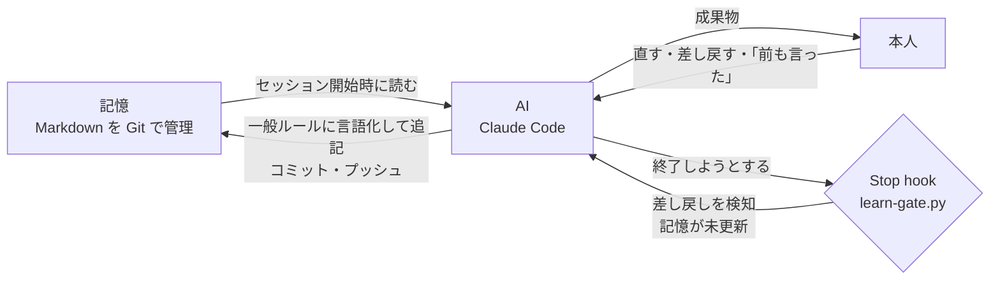

# ai-memory

**AIに「それ、前も言ったよね」と言わせないための外部記憶。** Markdown と Git だけで、AIが一度言われたことを覚え続け、直されたら自分でルール化して保存する仕組みのテンプレートです。

## 何が困りごとか

チャットAIは会話ごとに忘れます。前のチャットで散々やったやりとりを、新しいチャットでは最初から説明し直すことになる。逆に、AIの出力を毎回同じところで直しているのに、次のチャットではまた同じ直しをさせられる。

原因は2つあります。

1. **記憶の置き場がない**。会話は流れて消える。AIの「メモリ」機能はサービスごと・端末ごとにバラバラで、チームの誰かが直しても他の人のAIには届かない
2. **学習のきっかけがない**。「これを覚えておいて」と毎回言う人はいない。直して、送って、終わり。学びは本人の頭にしか残らない

## 仕組み



3つの部品でできています。

| 部品 | 役割 | 場所 |
|---|---|---|
| **記憶** | 事実・決定・直しのルールを Markdown で持つ。Git なので履歴が残り、端末と人をまたいで同期される | `profile.md` `current.md` `decisions.md` `feedback.md` `people/` `projects/` |
| **読み込み順と学習ループの定義** | AIに「何をどの順で読むか」「直されたら何をどこに書くか」を指示する | `AGENTS.md`(`CLAUDE.md` はそのシンボリックリンク。Codex / Cursor は `AGENTS.md` を直接読む) |
| **自動学習ゲート** | セッション終了時に会話を走査し、差し戻し・書き換え・「前も言った」・新しい決定の発言を見つけたら、**記憶への追記とコミット・プッシュが終わるまで終了させない** | `scripts/learn-gate.py`(Claude Code / Codex / Cursor の Stop hook から共通で呼ぶ) |

「学習して」と言わなくても学習が回るのは、3つ目の部品があるからです。人は「覚えておいて」とは言いません。直すだけです。だから、直された痕跡を機械的に拾って、AI側に学習を強制します。

## 5分でセットアップ

1. このリポジトリを **Use this template** で自分のリポジトリにする(または clone)
2. ローカルで初期化する

   ```bash
   ./setup.sh
   ```

   所有者名を聞かれるので入力。`git init`・`CLAUDE.md` のリンク・最終更新日の記入・初回コミットまでやります
3. `profile.md` を埋める。**完璧な資料は不要**。会社概要と今やっていることを3〜10行書けば動きます
4. Claude Code / Codex / Cursor のどれかでこのディレクトリを開く。初回に hooks を有効にするか聞かれるので許可する(Codex は `~/.codex/config.toml` に `[features] hooks = true` が必要)
5. 普通に仕事を頼む。直す。終わる。——終了時に AI が「feedback.md に〇〇のルールを追記してプッシュしました」と報告してきたら、仕組みが回っています

## 実際の流れ(例)

1. 「山田製菓の会長へのお礼メールを書いて」
2. AIが下書きを出す。締めが「ぜひお声がけください」になっている
3. 「締めは『〜いただければと思います』にして。前も言ったよね」
4. AIが直す。会話が終わる
5. **ここで Stop hook が動く**。「前も言ったよね」を検知し、記憶が未更新なので終了を止める
6. AIが `feedback.md` に「依頼の締めは命令形にしない(2026-09-11・山田製菓お礼メールで確定)」と追記し、コミット・プッシュして終了
7. 翌週、別の端末で、別の相手へのメールを頼む。締めは最初から正しい

## ファイル構成

| ファイル | 内容 | 更新頻度 |
|---|---|---|
| `AGENTS.md` | AI向けの共通指示(読み込み順・学習ループ・書き方の型) | 低 |
| `CLAUDE.md` | `AGENTS.md` へのシンボリックリンク(Claude Code が自動で読む) | — |
| `profile.md` | 所有者・会社の基本情報。変わりにくい事実 | 低 |
| `current.md` | 今の優先事項。冒頭に最終更新日 | 週次 |
| `decisions.md` | 決定事項の台帳。「〜にする」「〜はやらない」 | 随時 |
| `feedback.md` | 差し戻しから抽出した一般ルール。文面を作る前にAIが読む | 直されるたび |
| `people/` | 相手・取引先ごとに1ファイル | 随時 |
| `projects/` | 案件ごとに1ファイル | 随時 |
| `.agents/skills/learn/` | 「学習しといて」と言われたときの手順(スキルの正本) | — |
| `.claude/` | Claude Code 用の配線。`settings.json` に hooks、`skills` は `.agents/skills` へのシンボリックリンク | — |
| `.codex/hooks.json` | Codex 用の配線(hooks) | — |
| `.cursor/hooks.json` | Cursor 用の配線(hooks) | — |
| `scripts/learn-gate.py` | Stop hook 本体。差し戻し検知・未コミット検知。3エージェント共通 | — |
| `scripts/session-start.sh` | セッション冒頭に記憶の鮮度と直近の変更を表示 | — |
| `docs/how-it-works.md` | hook の動作の詳細・カスタマイズ・テスト方法 | — |

## 対応エージェント

正本は `AGENTS.md`(指示)と `.agents/skills/`(スキル)と `scripts/`(hook 本体)の3つだけ。エージェントごとのディレクトリには配線しか置かないので、別のエージェントに乗り換えても記憶と学習ループはそのまま動きます。

| | 指示の読み込み | スキル | 自動学習ゲート |
|---|---|---|---|
| **Claude Code** | `CLAUDE.md`(`AGENTS.md` へのシンボリックリンク) | `.claude/skills` → `.agents/skills` | `.claude/settings.json` の `Stop` hook |
| **Codex** | `AGENTS.md` を直接読む | `.agents/skills` を直接読む | `.codex/hooks.json` の `Stop` hook(形式は Claude と同じ) |
| **Cursor** | `AGENTS.md` を直接読む | `.agents/skills` を直接読む | `.cursor/hooks.json` の `stop` hook(`followup_message` で続行させる。既定で5回まで) |
| **ChatGPT / Gemini(チャット)** | 最初に `AGENTS.md` を読ませる | — | なし。直しは手で `feedback.md` に書く |

`scripts/learn-gate.py` は渡された JSON の形で呼び出し元を判別し、Claude / Codex には `decision: block`、Cursor には `followup_message` を返します。Codex の hooks は実験的機能で Windows 非対応(2026-09 時点)。Windows で clone する場合は `git config core.symlinks true` を先に設定しないと `CLAUDE.md` と `.claude/skills` が実ファイルになります。

## Claude Code 以外で使う

- **Claude.ai(チャット)**: Project の GitHub 連携でこのリポジトリを読ませる。読みは効くが、書き戻し(学習)は Claude Code 側で行う。チームなら「更新は担当者が Claude Code で」の分業にする
- **claude.ai/code(ブラウザ版 Claude Code)**: ターミナル不要。リポジトリを選んでチャットするだけで hooks も動く。非エンジニアにはここが入口
- **ChatGPT / Gemini**: 必要なファイルを添付するか GitHub 連携で読ませ、最初に `AGENTS.md` を読ませる。自動学習は動かないので、直しは手で `feedback.md` に書く

## 運用のコツ

- **記憶は少なく濃く**。ファイルを増やすほど賢くなるわけではない。コア20ファイル以内、1ファイル数ページ。増やす前に既存ファイルへの追記を考える
- **完了したことは消す**。Git 履歴で戻せるので、アーカイブは作らない
- **機密は入れない**。パスワード・APIキー・第三者の個人情報はこのリポジトリに置かない
- **週1回 `current.md` を見直す**。AIは冒頭の最終更新日で鮮度を判断する。SessionStart hook が2週間放置を警告する

## 検知キーワードを変える

`scripts/learn-gate.py` の `SIGNALS` が検知語のリストです。業種や口癖に合わせて足してください。過検知しても害はありません(AIが「追記不要」と一言述べて終わるだけ)。見逃しの方が損なので、迷ったら足す側に倒します。

## 由来

作者が自分の事業用に運用している外部記憶リポジトリ(非公開)から、業務固有のスキル(スライド生成・動画編集・応募文など)を外し、記憶と学習ループだけを抜き出したものです。考え方の入門は動画「[Claude Cowork × Googleドライブで会社の記憶を作る](https://www.youtube.com/@ichigoooo015)」(Google ドライブ版・読み専用)。このリポジトリはその Git 版で、**AIが自分で記憶を更新する**点が違います。

## License

MIT
